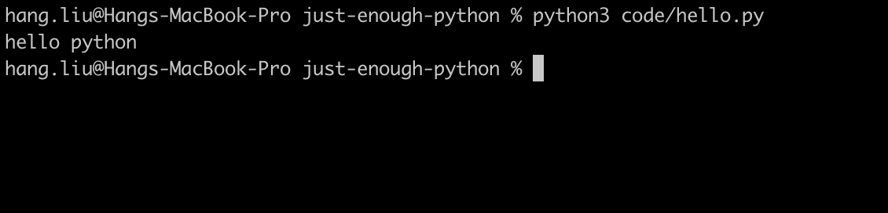

## Python 版本
目前 Python 有两个主要版本 2.x 和 3.x。注意！两个版本是不兼容的。

但随着 3.x 的逐渐流行，以及被越来越多的库所支持，我们就直接进入到 3.x 版本吧！

## 安装 Pyhont
#### Windows
下载地址：https://www.python.org/downloads/

#### Mac
Mac 系统自带了 Python 2，但我们需要另外安装 Python 3 来使用。

```
brew install python3
```

#### Linux
如果你已经有 Linux 的使用经验，这个教程浅显程度可能会引发大面积吐槽。人生苦短，

## 运行 Python
Python 有两种运行方式，交互式命令行和执行.py文件

#### 交互式命令行
打开一个你顺手的命令行界面（可以在[utils](./utils.md)得到更多指导），通过 python3 进入 Python 交互式环境。


#### 执行.py文件
可以将需要执行的一系列指令存储在以.py为后缀名的文件中，使用 Python 解释器即可解释执行。

